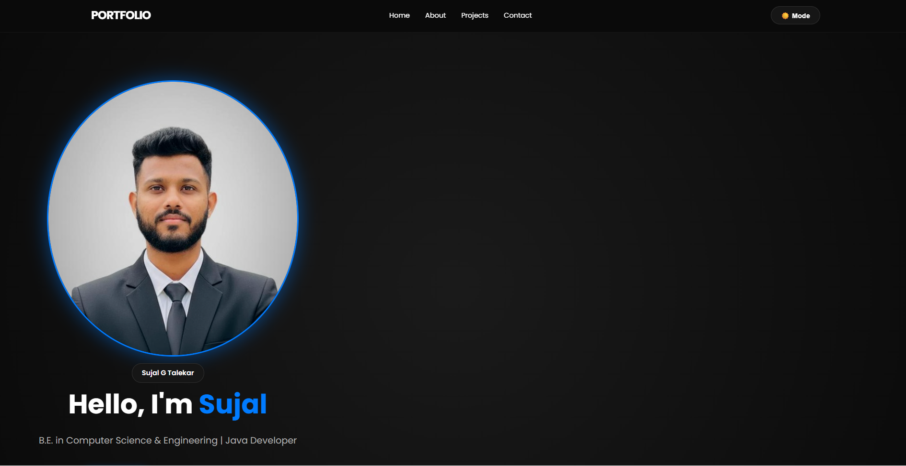
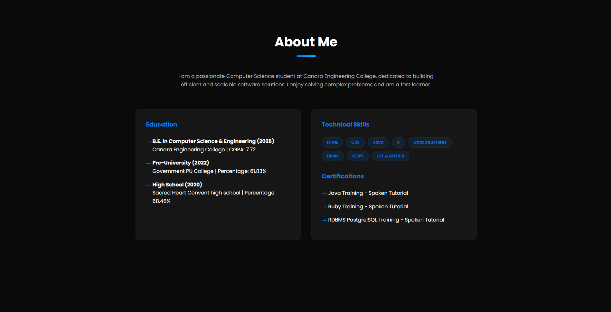
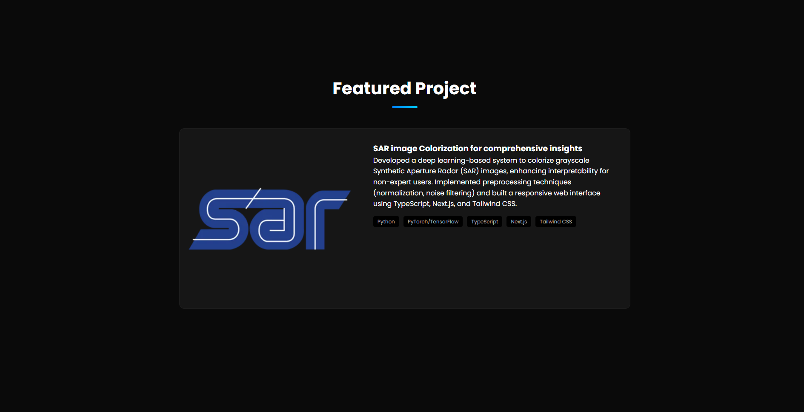
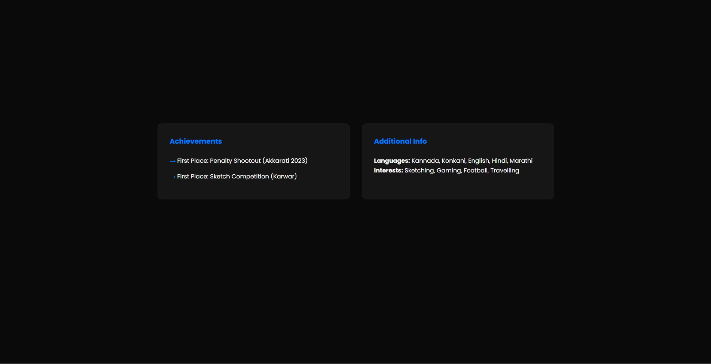
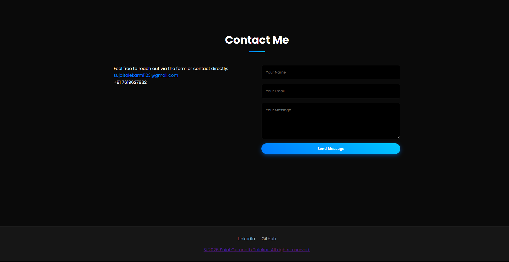

# 🌐 Personal Portfolio Website

A modern and responsive personal portfolio website built using HTML, CSS, and JavaScript with smooth animations, dark/light mode support, and interactive UI components.

The website showcases personal information, technical skills, projects, achievements, certifications, and contact details in a clean and professional layout.

---

# 🚀 Features

## 🎨 UI & Design
- Modern dark/light theme
- Responsive layout for all devices
- Smooth scrolling navigation
- Animated sections on scroll
- Interactive hover effects
- Professional card-based layout
- Gradient buttons & glowing effects

---

## ⚡ JavaScript Features
- Dark/Light mode toggle
- Theme persistence using LocalStorage
- Scroll-triggered animations using Intersection Observer API
- Contact form validation
- Dynamic UI interactions

---

# 🛠 Tech Stack

## Frontend
- HTML5
- CSS3
- JavaScript (Vanilla JS)

## Tools Used
- VS Code
- Git & GitHub

---

# 📂 Project Structure

```bash
Portfolio/
│
├── index.html
├── style.css
├── script.js
├── profile.jpg
├── sar.webp
├── screenshots/
│   ├── home.png
│   ├── about.png
│   ├── project.png
│   ├── achievements.png
│   └── contact.png
│
└── README.md
```

---

# ✨ Main Sections

## 🏠 Home Section
- Profile image
- Introduction
- Resume download button
- Animated hero section

---

## 👨‍💻 About Section
- Education details
- Technical skills
- Certifications
- Professional summary

---

## 🚀 Projects Section
### Featured Project:
**SAR Image Colorization for Comprehensive Insights**

- Deep learning based SAR image colorization
- Built using:
  - Python
  - TensorFlow/PyTorch
  - Next.js
  - Tailwind CSS

---

## 🏆 Achievements Section
- Penalty Shootout Winner
- Sketch Competition Winner

---

## 📞 Contact Section
- Contact form validation
- Email and phone details
- LinkedIn & GitHub links

---

# 🌙 Dark Mode Feature

The website supports:
- Dark mode
- Light mode

Theme preference is saved using:

```javascript
localStorage
```

so the selected theme remains after refreshing the page.

---

# 🎬 Animations Used

- Fade-in animations
- Scroll reveal effects
- Button hover scaling
- Card hover transitions
- Smooth scrolling navigation

---

# 📸 Screenshots

## 🏠 Homepage



---

## 👨‍💻 About Section



---

## 🚀 Featured Project



---

## 🏆 Achievements Section



---

## 📞 Contact Section



---

# 💻 How To Run The Project

## 1️⃣ Clone Repository

```bash
git clone YOUR_REPOSITORY_LINK
```

---

## 2️⃣ Open Project Folder

Open project in VS Code.

---

## 3️⃣ Run Using Live Server

Install:
- Live Server Extension

Then:

Right click:
```bash
index.html
```

Click:
```bash
Open with Live Server
```

---

# 📚 Learning Outcomes

- Responsive Web Design
- CSS Animations
- JavaScript DOM Manipulation
- Theme Switching
- Form Validation
- Scroll-based Animations
- Portfolio UI Design
- GitHub Project Management

---

# 👨‍💻 Author

Developed by Sujal Gurunath Talekar as a modern personal portfolio website project.

---