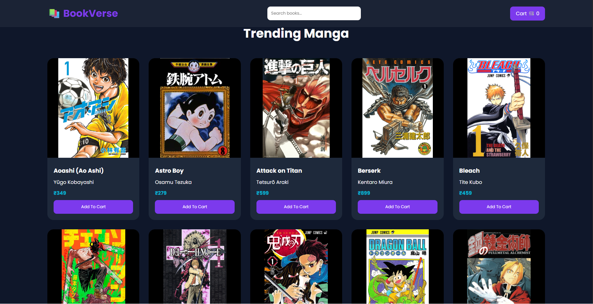
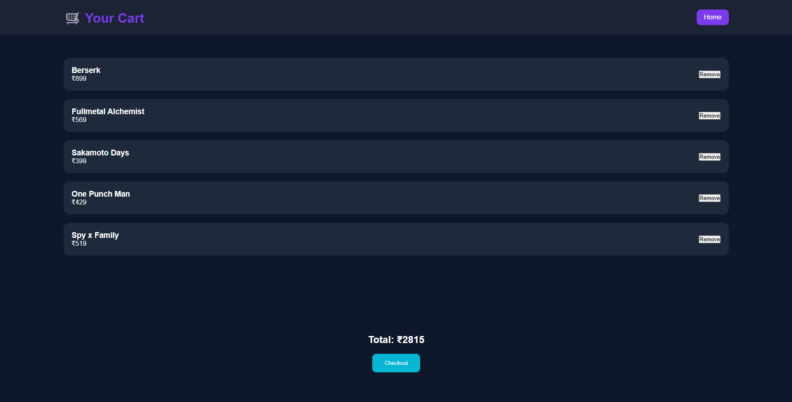
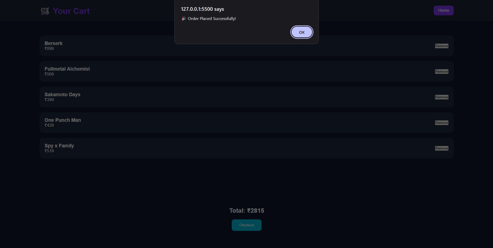

# 📚 AnimeVerse - Online Manga Bookstore

AnimeVerse is a modern full-stack online manga bookstore built using HTML, CSS, JavaScript, Java Spring Boot, and REST APIs.

Users can browse manga collections, search books, add books to cart, and simulate checkout functionality with a modern animated UI.

---

# 🚀 Features

## 🎨 Frontend Features
- Modern animated UI
- Responsive book cards
- Search functionality
- Add to Cart system
- Remove from Cart
- Checkout popup
- Smooth hover animations
- Dynamic manga cover images

---

## ⚙ Backend Features
- Spring Boot REST API
- MVC architecture
- Controller layer
- Service layer
- JSON API responses
- Dynamic book fetching
- Frontend & Backend integration

---

# 🛠 Tech Stack

## Frontend
- HTML5
- CSS3
- JavaScript

## Backend
- Java
- Spring Boot
- Spring Web MVC

## Tools
- IntelliJ IDEA
- VS Code
- Git & GitHub

---

# 📂 Project Structure

```bash
AnimeVerse/
│
├── frontend/
│   ├── index.html
│   ├── cart.html
│   ├── style.css
│   ├── script.js
│   └── images/
│
├── backend/
│   ├── src/main/java/com/example/bookstore/
│   │   ├── controller/
│   │   ├── model/
│   │   ├── service/
│   │   └── BookstoreApplication.java
│   │
│   └── src/main/resources/
│       └── application.properties
│
└── README.md
```

---

# 🔗 REST API Endpoints

| Method | Endpoint | Description |
|---|---|---|
| GET | `/books` | Fetch all books |

Example:
```bash
http://localhost:8081/books
```

---

# 💻 How To Run The Project

# Backend Setup

## 1️⃣ Open Backend in IntelliJ IDEA

Open:
```bash
backend/
```

---

## 2️⃣ Run Spring Boot Application

Run:
```bash
BookstoreApplication.java
```

Server starts on:
```bash
http://localhost:8081
```

---

# Frontend Setup

## 1️⃣ Open Frontend Folder in VS Code

Open:
```bash
frontend/
```

---

## 2️⃣ Install Live Server Extension

Install:
- Live Server

---

## 3️⃣ Run Frontend

Right click:
```bash
index.html
```

Click:
```bash
Open with Live Server
```

---

# 🔄 Frontend & Backend Connection

Frontend fetches data from backend using:

```javascript
fetch("http://localhost:8081/books")
```

Backend returns manga data as JSON using Spring Boot REST API.

---

# 📸 Screenshots

## 🏠 Homepage



---

## 🛒 Cart Page



---

## ✅ Checkout



## Homepage
- Animated hero section
- Manga cards
- Search functionality

## Cart Page
- Added manga list
- Total price calculation
- Remove functionality

---

# 🌟 Manga Collection Included

- Aoashi
- Attack on Titan
- Berserk
- Chainsaw Man
- Death Note
- Demon Slayer
- Dragon Ball
- Naruto
- One Piece
- Tokyo Ghoul
- Vinland Saga
- and many more...

---

# 🎯 Learning Outcomes

- Frontend UI Design
- JavaScript DOM Manipulation
- REST API Development
- Spring Boot MVC Architecture
- Frontend & Backend Integration
- Local Storage Handling
- GitHub Project Management

---

# 👨‍💻 Author

Developed as a Full Stack Manga Bookstore Project using Java Spring Boot and Frontend Technologies.

---